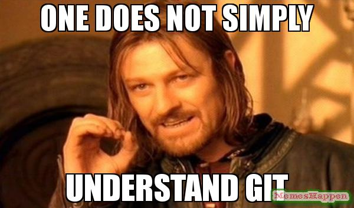
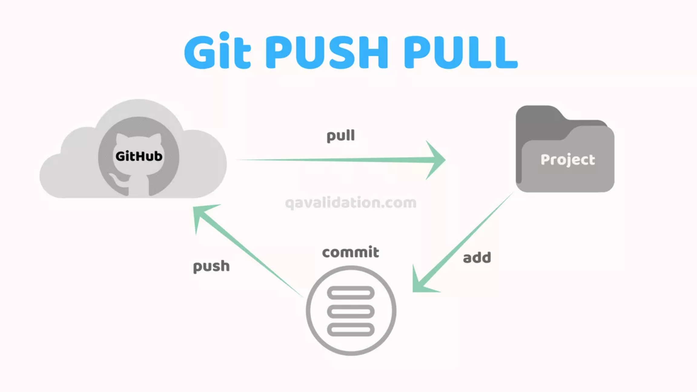
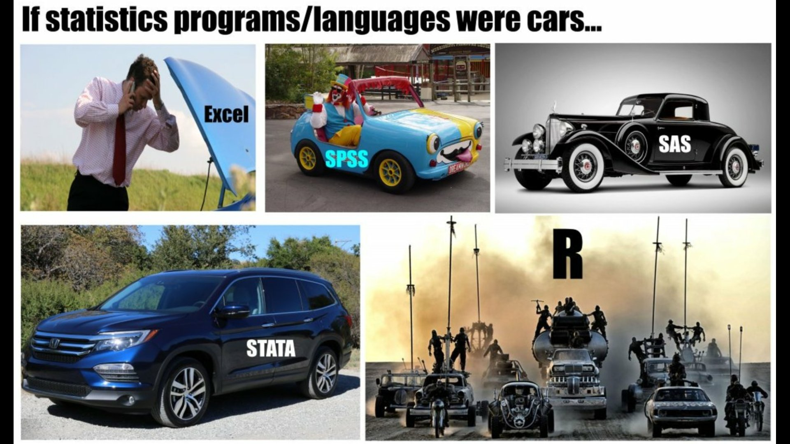

```{r setup, include=FALSE}
# load packages
library(knitr)
library(tidyverse)
library(lubridate)
library(gtsummary)
library(here)

# set output options
opts_chunk$set(fig.width = 5, 
               fig.height = 4
)
```


# Outline

- Overview of R Workflow

- Linear & Logistic Regression Case Study

- Functions

- Git/ Github 

- *Not covered but will provide code:* 
    - Code for cleaning data with dates
    - Linear Mixed Effects Models
    - Shiny Apps

---

# The R Analysis Workflow

- Clean and Explore Data
    - `dplyr`
    - `lubridate` 
- Analyze it
    - `stats`
    - `survival`
    - `lme4`/ `lmer`
    - `ggplot` 
- Report Your Findings
    - R Markdown / `knitr`
    - `gt` / `gtsummary`
    - `broom` 
- Iterate, Share, and Collaborate!
    - `git`/ `github`
    - `devtools` & `usethis`


---
# Case Study - Modeling Diabetes Risk Factors

- Analyze risk factors for diabetes
- Is waist to hip ratio a risk factor for diabetes?

- Outcome: glycosolated hemoglobin level (> 7 is considered diabetic)

- Available Variables of interest: 
    - cholesterol level 
    - stabilized glucose
    - location of individual
    - age
    - gender
    - height/weight
    - body frame
    - waist in inches
    - hip in inches
    
```{r}
library(faraway)
?diabetes
```

---
# Reproducibility 

*Why is a Reproducible R Workflow Important?*

---
# Reproducibility 

*Why is a Reproducible R Workflow Important?*
- Allows you to show evidence of your results

- Encourages transparency about decisions made during analysis

- Enables others to check and use/extend your methods and results

- Enables FUTURE YOU to check and use/extend your methods and results

---
# Reproducibility 

*How do we ensure our R code is reproducible?*
- Have a clear project workflow structure

- Comment and document your code

- Use reproducible reporting practice (e.g. Rmd inline text)

- Avoid absolute file paths (e.g. `~/Users/Whiting/Projects...`)

- Version control (document changes you make, or use git!)

- Read More: https://ropensci.github.io/reproducibility-guide/

---
# Why Write a Function? 

- D.R.Y. - limit copy pasting and potential mistakes 

- Automate common tasks 

- You only need to update code in one place 


---
# Function Tips 

- If you are copy pasting code > 3 times, write a function

- Give your function a useful name 


---
# Function Example 

```{r}
add_one <- function(number) {
  result = number + 1 
  return(result)
}

add_one(7)
#add_one("hai")
```

---
# Function Practice

Write a function to calculate BMI given height (inchs) and weight (lbs) 

BMI = (weight * 703) / (height)^2 

```{r, eval = FALSE}
calc_bmi <- function() {
  ?????????????
}

```


---
# Git and Github 

```{r, echo=FALSE}
   
```


---
# Git and Github 


- *Git* is version control software that records changes to a file/ project. 
    - View specific changes to code over time
    
    - Revert files to past states as needed
    
- *Github* web-based UI and social platform that works on top of git.
    - Upload your code so others can view and contribute to it
     
    - View and contribute to other projects

    
    
---
# Git and Github 


- *Git* is version control software that records changes to a file/ project. 
    - View specific changes to code over time
    
    - Revert files to past states as needed
    
- *Github* web-based UI and social platform that works on top of git.
    - Upload your code so others can view and contribute to it
     
    - View and contribute to other projects

- **NOTE: DON'T PUT CODE OR DATA ON GITHUB IF PROJECT USES PROTECTED DATA**

---
# Git and Github 

```{r, echo=FALSE}
   
```

---
# Last Notes 

- Stack Overflow is your friend: https://stackoverflow.com/

- Help eachother! (but also learn how to read R documentation)

- Stay in the loop
    - Rbloggers: https://www.r-bloggers.com/
    - Twitter: @hadleywickham, @JennyBryan, #rstats
    
- Get involved
    - Start a github account
    - Make a package
    
---
# THANK YOU!!

```{r, echo=FALSE}
   
```
